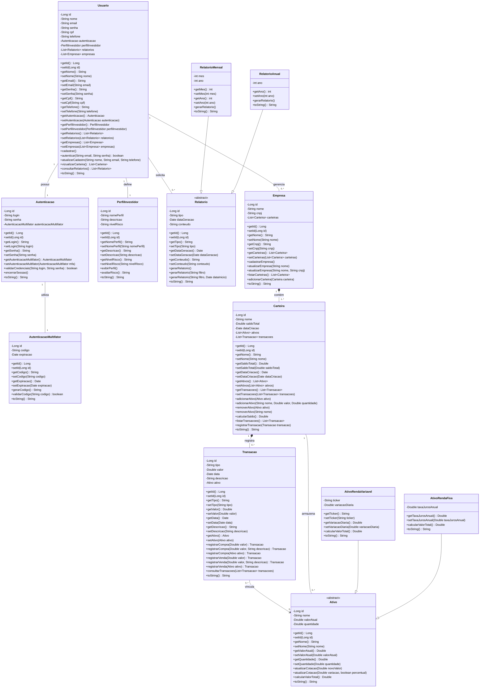

```mermaid
classDiagram
    class Usuario {
        -Long id
        -String nome
        -String email
        -String senha
        -String cpf
        -String telefone
        -Autenticacao autenticacao
        -PerfilInvestidor perfilInvestidor
        -List~Relatorio~ relatorios
        -List~Empresa~ empresas
        +getId() Long
        +setId(Long id)
        +getNome() String
        +setNome(String nome)
        +getEmail() String
        +setEmail(String email)
        +getSenha() String
        +setSenha(String senha)
        +getCpf() String
        +setCpf(String cpf)
        +getTelefone() String
        +setTelefone(String telefone)
        +getAutenticacao() Autenticacao
        +setAutenticacao(Autenticacao autenticacao)
        +getPerfilInvestidor() PerfilInvestidor
        +setPerfilInvestidor(PerfilInvestidor perfilInvestidor)
        +getRelatorios() List~Relatorio~
        +setRelatorios(List~Relatorio~ relatorios)
        +getEmpresas() List~Empresa~
        +setEmpresas(List~Empresa~ empresas)
        +cadastrar()
        +autenticar(String email, String senha) boolean
        +atualizarCadastro(String nome, String email, String telefone)
        +vizualizarCarteira() List~Carteira~
        +consultarRelatorios() List~Relatorio~
        +toString() String
    }

    class Autenticacao {
        -Long id
        -String login
        -String senha
        -AutenticacaoMultifator autenticacaoMultifator
        +getId() Long
        +setId(Long id)
        +getLogin() String
        +setLogin(String login)
        +getSenha() String
        +setSenha(String senha)
        +getAutenticacaoMultifator() AutenticacaoMultifator
        +setAutenticacaoMultifator(AutenticacaoMultifator mfa)
        +validarCredenciais(String login, String senha) boolean
        +encerrarSessao()
        +toString() String
    }

    class AutenticacaoMultifator {
        -Long id
        -String codigo
        -Date expiracao
        +getId() Long
        +setId(Long id)
        +getCodigo() String
        +setCodigo(String codigo)
        +getExpiracao() Date
        +setExpiracao(Date expiracao)
        +gerarCodigo() String
        +validarCodigo(String codigo) boolean
        +toString() String
    }

    class PerfilInvestidor {
        -Long id
        -String nomePerfil
        -String descricao
        -String nivelRisco
        +getId() Long
        +setId(Long id)
        +getNomePerfil() String
        +setNomePerfil(String nomePerfil)
        +getDescricao() String
        +setDescricao(String descricao)
        +getNivelRisco() String
        +setNivelRisco(String nivelRisco)
        +exibirPerfil()
        +avaliarRisco() String
        +toString() String
    }

    class Relatorio {
        <<abstract>>
        -Long id
        -String tipo
        -Date dataGeracao
        -String conteudo
        +getId() Long
        +setId(Long id)
        +getTipo() String
        +setTipo(String tipo)
        +getDataGeracao() Date
        +setDataGeracao(Date dataGeracao)
        +getConteudo() String
        +setConteudo(String conteudo)
        +gerarRelatorio()
        +gerarRelatorio(String filtro)
        +gerarRelatorio(String filtro, Date dataInicio)
        +toString() String
    }

    class RelatorioAnual {
        -int ano
        +getAno() int
        +setAno(int ano)
        +gerarRelatorio()
        +toString() String
    }

    class RelatorioMensal {
        -int mes
        -int ano
        +getMes() int
        +setMes(int mes)
        +getAno() int
        +setAno(int ano)
        +gerarRelatorio()
        +toString() String
    }

    class Empresa {
        -Long id
        -String nome
        -String cnpj
        -List~Carteira~ carteiras
        +getId() Long
        +setId(Long id)
        +getNome() String
        +setNome(String nome)
        +getCnpj() String
        +setCnpj(String cnpj)
        +getCarteiras() List~Carteira~
        +setCarteiras(List~Carteira~ carteiras)
        +cadastrarEmpresa()
        +atualizarEmpresa(String nome)
        +atualizarEmpresa(String nome, String cnpj)
        +listarCarteiras() List~Carteira~
        +adicionarCarteira(Carteira carteira)
        +toString() String
    }

    class Carteira {
        -Long id
        -String nome
        -Double saldoTotal
        -Date dataCriacao
        -List~Ativo~ ativos
        -List~Transacao~ transacoes
        +getId() Long
        +setId(Long id)
        +getNome() String
        +setNome(String nome)
        +getSaldoTotal() Double
        +setSaldoTotal(Double saldoTotal)
        +getDataCriacao() Date
        +setDataCriacao(Date dataCriacao)
        +getAtivos() List~Ativo~
        +setAtivos(List~Ativo~ ativos)
        +getTransacoes() List~Transacao~
        +setTransacoes(List~Transacao~ transacoes)
        +adicionarAtivo(Ativo ativo)
        +adicionarAtivo(String nome, Double valor, Double quantidade)
        +removerAtivo(Ativo ativo)
        +removerAtivo(String nome)
        +calcularSaldo() Double
        +listarTransacoes() List~Transacao~
        +registrarTransacao(Transacao transacao)
        +toString() String
    }

    class Ativo {
        <<abstract>>
        -Long id
        -String nome
        -Double valorAtual
        -Double quantidade
        +getId() Long
        +setId(Long id)
        +getNome() String
        +setNome(String nome)
        +getValorAtual() Double
        +setValorAtual(Double valorAtual)
        +getQuantidade() Double
        +setQuantidade(Double quantidade)
        +atualizarCotacao(Double novoValor)
        +atualizarCotacao(Double variacao, boolean percentual)
        +calcularValorTotal() Double
        +toString() String
    }

    class AtivoRendaFixa {
        -Double taxaJurosAnual
        +getTaxaJurosAnual() Double
        +setTaxaJurosAnual(Double taxaJurosAnual)
        +calcularValorTotal() Double
        +toString() String
    }

    class AtivoRendaVariavel {
        -String ticker
        -Double variacaoDiaria
        +getTicker() String
        +setTicker(String ticker)
        +getVariacaoDiaria() Double
        +setVariacaoDiaria(Double variacaoDiaria)
        +calcularValorTotal() Double
        +toString() String
    }

    class Transacao {
        -Long id
        -String tipo
        -Double valor
        -Date data
        -String descricao
        -Ativo ativo
        +getId() Long
        +setId(Long id)
        +getTipo() String
        +setTipo(String tipo)
        +getValor() Double
        +setValor(Double valor)
        +getData() Date
        +setData(Date data)
        +getDescricao() String
        +setDescricao(String descricao)
        +getAtivo() Ativo
        +setAtivo(Ativo ativo)
        +registrarCompra(Double valor) Transacao
        +registrarCompra(Double valor, String descricao) Transacao
        +registrarCompra(Ativo ativo) Transacao
        +registrarVenda(Double valor) Transacao
        +registrarVenda(Double valor, String descricao) Transacao
        +registrarVenda(Ativo ativo) Transacao
        +consultarTransacoes(List~Transacao~ transacoes)
        +toString() String
    }

    %% Herança
    AtivoRendaFixa --|> Ativo
    AtivoRendaVariavel --|> Ativo
    RelatorioAnual --|> Relatorio
    RelatorioMensal --|> Relatorio

    %% Relacionamentos
    Usuario "1" -- "1" Autenticacao : possui
    Autenticacao "1" -- "1" AutenticacaoMultifator : utiliza
    Usuario "1" -- "1" PerfilInvestidor : define
    Usuario "1" -- "0..*" Relatorio : solicita
    Usuario "1" -- "0..*" Empresa : gerencia
    Empresa "1" *-- "1..*" Carteira : contém
    Carteira "1" -- "0..*" Ativo : armazena
    Carteira "1" *-- "0..*" Transacao : registra
    Transacao "0..*" --> "0..1" Ativo : vincula
```
