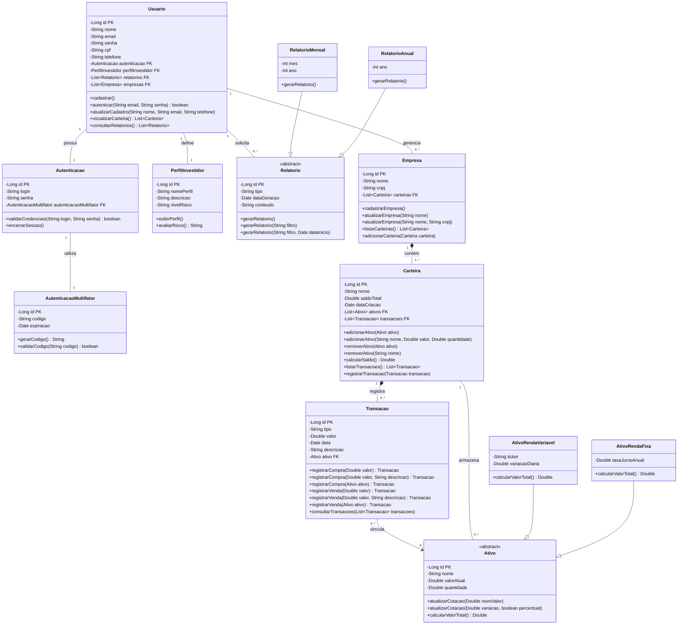

```mermaid
classDiagram
    class Usuario {
        -Long id PK
        -String nome
        -String email
        -String senha
        -String cpf
        -String telefone
        -Autenticacao autenticacao FK
        -PerfilInvestidor perfilInvestidor FK
        -List~Relatorio~ relatorios FK
        -List~Empresa~ empresas FK
        +cadastrar()
        +autenticar(String email, String senha) boolean
        +atualizarCadastro(String nome, String email, String telefone)
        +vizualizarCarteira() List~Carteira~
        +consultarRelatorios() List~Relatorio~
    }

    class Autenticacao {
        -Long id PK
        -String login
        -String senha
        -AutenticacaoMultifator autenticacaoMultifator FK
        +validarCredenciais(String login, String senha) boolean
        +encerrarSessao()
    }

    class AutenticacaoMultifator {
        -Long id PK
        -String codigo
        -Date expiracao
        +gerarCodigo() String
        +validarCodigo(String codigo) boolean
    }

    class PerfilInvestidor {
        -Long id PK
        -String nomePerfil
        -String descricao
        -String nivelRisco
        +exibirPerfil()
        +avaliarRisco() String
    }

    class Relatorio {
        <<abstract>>
        -Long id PK
        -String tipo
        -Date dataGeracao
        -String conteudo
        +gerarRelatorio()
        +gerarRelatorio(String filtro)
        +gerarRelatorio(String filtro, Date dataInicio)
    }

    class RelatorioAnual {
        -int ano
        +gerarRelatorio()
    }

    class RelatorioMensal {
        -int mes
        -int ano
        +gerarRelatorio()
    }

    class Empresa {
        -Long id PK
        -String nome
        -String cnpj
        -List~Carteira~ carteiras FK
        +cadastrarEmpresa()
        +atualizarEmpresa(String nome)
        +atualizarEmpresa(String nome, String cnpj)
        +listarCarteiras() List~Carteira~
        +adicionarCarteira(Carteira carteira)
    }

    class Carteira {
        -Long id PK
        -String nome
        -Double saldoTotal
        -Date dataCriacao
        -List~Ativo~ ativos FK
        -List~Transacao~ transacoes FK
        +adicionarAtivo(Ativo ativo)
        +adicionarAtivo(String nome, Double valor, Double quantidade)
        +removerAtivo(Ativo ativo)
        +removerAtivo(String nome)
        +calcularSaldo() Double
        +listarTransacoes() List~Transacao~
        +registrarTransacao(Transacao transacao)
    }

    class Ativo {
        <<abstract>>
        -Long id PK
        -String nome
        -Double valorAtual
        -Double quantidade
        +atualizarCotacao(Double novoValor)
        +atualizarCotacao(Double variacao, boolean percentual)
        +calcularValorTotal() Double
    }

    class AtivoRendaFixa {
        -Double taxaJurosAnual
        +calcularValorTotal() Double
    }

    class AtivoRendaVariavel {
        -String ticker
        -Double variacaoDiaria
        +calcularValorTotal() Double
    }

    class Transacao {
        -Long id PK
        -String tipo
        -Double valor
        -Date data
        -String descricao
        -Ativo ativo FK
        +registrarCompra(Double valor) Transacao
        +registrarCompra(Double valor, String descricao) Transacao
        +registrarCompra(Ativo ativo) Transacao
        +registrarVenda(Double valor) Transacao
        +registrarVenda(Double valor, String descricao) Transacao
        +registrarVenda(Ativo ativo) Transacao
        +consultarTransacoes(List~Transacao~ transacoes)
    }

    %% Herança
    AtivoRendaFixa --|> Ativo
    AtivoRendaVariavel --|> Ativo
    RelatorioAnual --|> Relatorio
    RelatorioMensal --|> Relatorio

    %% Relacionamentos
    Usuario "1" -- "1" Autenticacao : possui
    Autenticacao "1" -- "1" AutenticacaoMultifator : utiliza
    Usuario "1" -- "1" PerfilInvestidor : define
    Usuario "1" -- "0..*" Relatorio : solicita
    Usuario "1" -- "0..*" Empresa : gerencia
    Empresa "1" *-- "1..*" Carteira : contém
    Carteira "1" -- "0..*" Ativo : armazena
    Carteira "1" *-- "0..*" Transacao : registra
    Transacao "0..*" --> "0..1" Ativo : vincula
```
